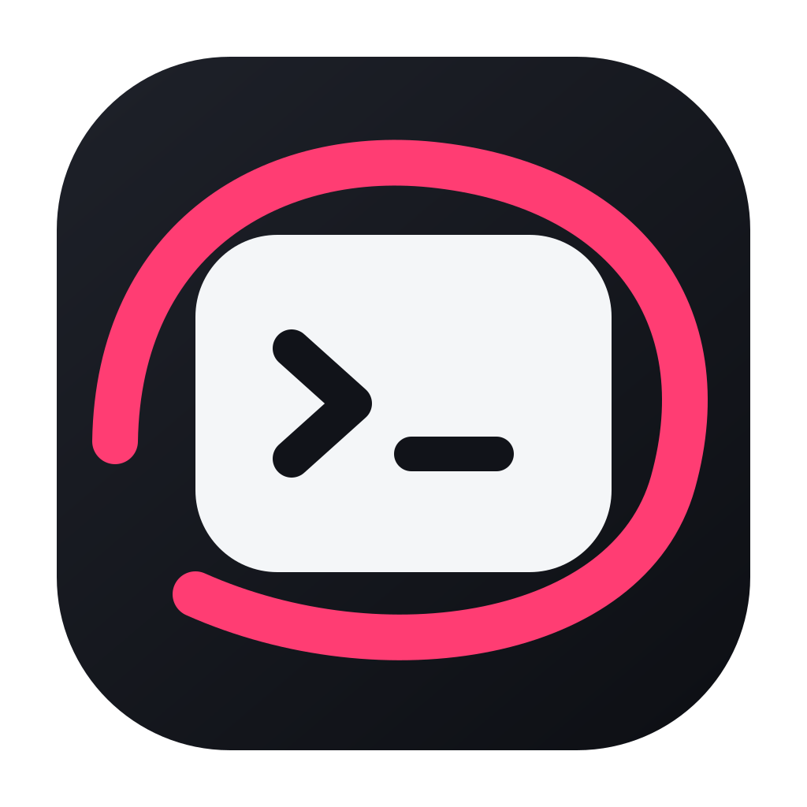

<div align="center">
  
  <h1>GhostMark</h1>
  <p>Mark up an image before it reaches Claude Code.</p>
</div>

## Install

Download the latest notarized `GhostMark.dmg` from the [download page](https://alan890104.github.io/GhostMark/) or GitHub Releases, drag GhostMark to Applications, and grant Accessibility access once.

Then paste an image with `Ctrl+V` or `⌘V` while Claude Code is active. GhostMark opens the editor and sends the finished image back with Claude Code's supported `Ctrl+V` shortcut.

## Features

- Works across Terminal, Ghostty, iTerm2, Warp, kitty, WezTerm, and embedded IDE terminals
- Pen, highlighter, eraser, colors, line width, undo, and redo
- Local-only image processing
- Native SwiftUI and AppKit; no third-party runtime dependencies

## Build

Requirements: macOS 14+, Xcode 16+, and Swift 6.

```sh
swift test
./Scripts/generate-icon.sh
./Scripts/build-app.sh
open GhostMark.app
```

Development builds are ad hoc signed. Public releases are built as Universal binaries, signed with Developer ID, hardened, notarized, and stapled by `Scripts/release.sh`.

## Release

```sh
./Scripts/release.sh v0.2.0
```

The release script requires a Developer ID Application identity and a `notarytool` Keychain profile. It builds and validates the DMG, pushes the version tag, and publishes the release assets. The GitHub Pages download button always targets `releases/latest/download/GhostMark.dmg`, so it automatically follows the newest release.

## Privacy

GhostMark has no analytics, telemetry, accounts, or uploads. See [PRIVACY.md](PRIVACY.md).

## License

MIT
